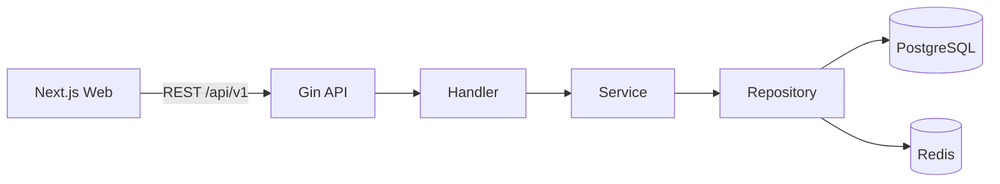

# NexaFlow

**Open Source AI Business Operating System**

**开源 AI 企业业务操作系统**

NexaFlow is a platform for composing business applications from reusable data,
permission, workflow, form, reporting, and AI capabilities. It is designed for
open-source distribution, commercial SaaS, private deployment, and long-lived
enterprise customization.

> Development is intentionally phased. The repository currently contains the
> Phase 1 platform foundation, not placeholder implementations of every future
> module.

## Phase 1 status

- Go 1.26.5 + Gin backend with graceful shutdown and structured Zap logging
- Clean request path: Handler → Service → Repository → PostgreSQL/Redis
- Unified API response contract and liveness/readiness endpoints
- Next.js 16.3 + TypeScript + Tailwind CSS 4 + shadcn/ui foundation
- Node.js 22 and pnpm 11 toolchain contract
- PostgreSQL 18 and Redis 8 container infrastructure
- Multi-stage, non-root backend and frontend images
- Responsive enterprise console shell with live backend dependency status

## Repository layout

```text
nexaflow/
├── backend/          # Go REST API
├── frontend/         # Next.js web application
├── docs/             # Architecture and operating documentation
├── docker/           # Local container orchestration
├── scripts/          # Development and verification helpers
├── CHANGELOG.md
├── CONTRIBUTING.md
├── LICENSE
└── README.md
```

## Quick start

Prerequisites: Docker Desktop with Compose, or Go 1.26.5 + Node.js 22 + pnpm 11
with locally running PostgreSQL and Redis.

```powershell
Copy-Item .env.example .env
docker compose --env-file .env -f docker/compose.yaml up --build
```

Open:

- Web console: <http://localhost:3000>
- API readiness: <http://localhost:8080/health/ready>
- Versioned API health: <http://localhost:8080/api/v1/health>

The defaults are for local development only. Replace all passwords before any
shared or production deployment.

## Local development

```powershell
# Backend (requires PostgreSQL and Redis)
Set-Location backend
go run ./cmd/server

# Frontend, in another terminal
Set-Location frontend
pnpm dev
```

Run the quality gate:

```powershell
./scripts/verify.ps1
```

## Architecture



See [architecture](docs/architecture.md), [development](docs/development.md),
[deployment](docs/deployment.md), and [database](docs/database.md) documentation.

## Roadmap

1. Platform foundation — complete
2. Authentication and sessions
3. RBAC, permissions, and dynamic menus
4. Multi-tenant organizations and subscriptions
5. Dynamic entity and JSONB record engine
6. Dynamic CRUD and form builder
7. Workflow, approvals, notifications, and dashboards
8. AI agent extension contracts

## License

Apache License 2.0. See [LICENSE](LICENSE).
