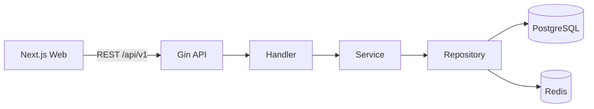

# NexaFlow

**Open Source AI Business Operating System**

**开源 AI 企业业务操作系统**

NexaFlow is a platform for composing business applications from reusable data,
permission, workflow, form, reporting, and AI capabilities. It is designed for
open-source distribution, commercial SaaS, private deployment, and long-lived
enterprise customization.


More product views are available in the [screenshot gallery](docs/screenshots/README.md).

## Demo

The repository includes a reproducible local demo rather than a hosted service
with shared credentials. Copy `.env.example`, set `JWT_SECRET`, run Docker
Compose, and open <http://localhost:3000>. The first visit launches the
Docker-aware initialization flow shown above; subsequent visits use `/login`.

The repository now covers the complete eight-phase platform roadmap. Docker
provides the infrastructure; `/install` is a secure first-run initialization
flow for readiness confirmation, the first enterprise, and its super admin.

## Platform status

- Go 1.26.5 + Gin backend with graceful shutdown and structured Zap logging
- Clean request path: Handler → Service → Repository → PostgreSQL/Redis
- Unified API response contract and liveness/readiness endpoints
- Next.js 16.3 + TypeScript + Tailwind CSS 4 + shadcn/ui foundation
- Node.js 22 and pnpm 11 toolchain contract
- PostgreSQL 18 and Redis 8 container infrastructure
- Multi-stage, non-root backend and frontend images
- Responsive enterprise console shell with live backend dependency status
- Six-step `/install` wizard with real environment diagnostics
- PostgreSQL database creation, bootstrap migrations, and Redis validation
- Transactional company + super-admin initialization and installation locking
- JWT login, single-use refresh rotation, logout, and active session management
- Four-role RBAC with protected permission administration and dynamic menus
- Active-tenant JWT/session context with membership-checked tenant switching
- Tenant-isolated users, roles, permission grants, sessions, and admin UI
- Tenant-scoped dynamic entity schemas with typed fields and version conflicts
- Responsive entity designer with ordering, defaults, options, and archiving
- Schema-validated generated CRUD APIs and responsive business-data editor
- Drag-and-drop form builder with persisted JSON Schema draft 2020-12
- Executable approval workflows with conditions, role gates, and optimistic locking
- In-app notifications plus durable email/Webhook outbox tasks
- pgvector knowledge ingestion for PDF, DOCX, XLSX, and text files
- Auditable, permission-scoped AI assistant with grounded sources
- Tenant file space backed by local, S3, or Cloudflare R2 object storage
- Drag-reorderable dashboards with server-bounded live aggregates
- SaaS plans, atomic quotas, Stripe Checkout, and signed idempotent webhooks

## Repository layout

```text
nexaflow/
├── backend/          # Go REST API
├── frontend/         # Next.js web application
├── docs/             # Architecture and operating documentation
├── docker/           # Local container orchestration
├── scripts/          # Development and verification helpers
├── CHANGELOG.md
├── CONTRIBUTING.md
├── LICENSE
└── README.md
```

## Quick start

Prerequisites: Docker Desktop with Compose, or Go 1.26.5 + Node.js 22 + pnpm 11
with locally running PostgreSQL and Redis.

```powershell
Copy-Item .env.example .env
docker compose --env-file .env -f docker/compose.yaml up --build
```

Open:

- First-run installer: <http://localhost:3000/install> (the home route redirects automatically)
- API readiness: <http://localhost:8080/health/ready>
- Versioned API health: <http://localhost:8080/api/v1/health>

The defaults are for local development only. Replace all passwords before any
shared or production deployment.

## Local development

```powershell
# Backend (starts in setup mode without PostgreSQL and Redis)
Set-Location backend
go run ./cmd/server

# Frontend, in another terminal
Set-Location frontend
pnpm dev
```

Run the quality gate:

```powershell
./scripts/verify.ps1
```

## Architecture



See [installation](docs/installation.md), [API](docs/api.md),
[architecture](docs/architecture.md), [development](docs/development.md),
[deployment](docs/deployment.md), [database](docs/database.md), and
[plugin extension guide](docs/plugin.md).

## Roadmap

1. Installation system — complete
2. Authentication and RBAC — complete
3. Multi-tenant organizations — complete
4. Dynamic entity engine — complete
5. Dynamic CRUD and form builder — complete
6. Workflow and approvals — complete
7. AI agent framework — complete
8. Commercial SaaS capabilities — complete

## License

Apache License 2.0. See [LICENSE](LICENSE).
