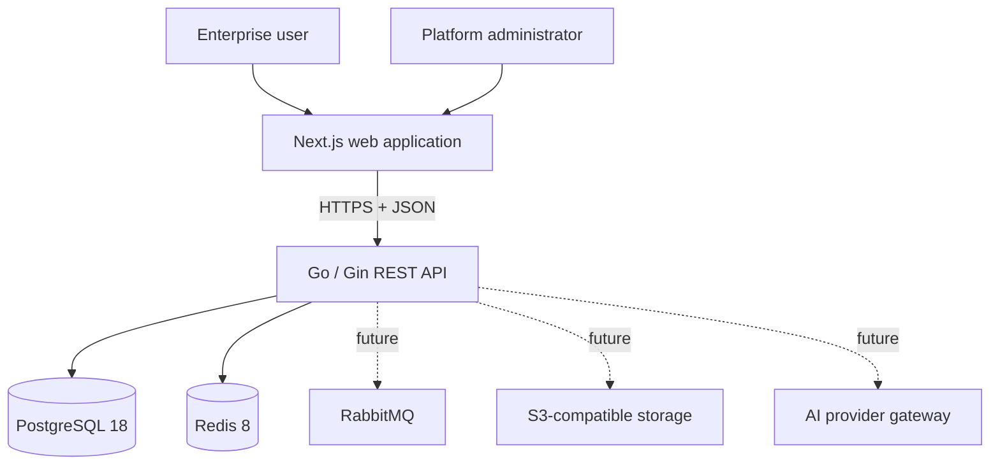
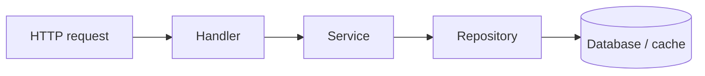

# Architecture

## Phase 1 decision record

NexaFlow starts as a modular monolith with a fully separated web client and REST
API. This keeps deployment and transactions understandable while preserving
module boundaries that can later be extracted when scale or team ownership—not
speculation—justifies distributed services.

### System context



### Backend dependency rule



- Handlers translate transport input and output; they never use GORM directly.
- Services own application rules and transaction boundaries.
- Repositories hide persistence details behind interfaces.
- Models contain transport-neutral domain and persistence data structures.
- Modules will compose these layers for each business capability.
- Shared packages are deliberately small and must not become a miscellaneous
  dependency bucket.

### Tenancy boundary

Tenant isolation is a Phase 4 capability, but its constraints are architectural
from day one:

- Every tenant-owned business aggregate will carry a non-null `tenant_id`.
- Repository methods will require tenant scope; handlers cannot choose to omit it.
- Unique constraints and high-cardinality indexes will begin with `tenant_id`.
- Background jobs and audit events will carry tenant context explicitly.
- Database row-level security remains an optional defense-in-depth layer, not a
  replacement for scoped repositories and authorization checks.

### API contract

All versioned endpoints live under `/api/v1` and return:

```json
{
  "code": 0,
  "message": "success",
  "data": {}
}
```

Business error codes are stable integers distinct from HTTP status codes. A
request ID is accepted or generated and returned in `X-Request-ID`.

### Security baseline

- Parameterized access through GORM; raw SQL requires review and bound values.
- Explicit CORS allowlist; no wildcard origin with credentials.
- Uniform error envelopes that do not expose infrastructure errors.
- Structured request logs with correlation IDs.
- Non-root runtime containers and minimal production images.
- Secrets are injected at runtime and never committed.
- Authentication, rate limiting, CSRF strategy, token rotation, and tenant-aware
  authorization are delivered with Phases 2–4 before business data endpoints.

### Evolution rule

New modules must first be implemented as deep modules inside the monolith. A
service may be extracted only after its interface, ownership, data boundary, and
operational benefit are proven.
