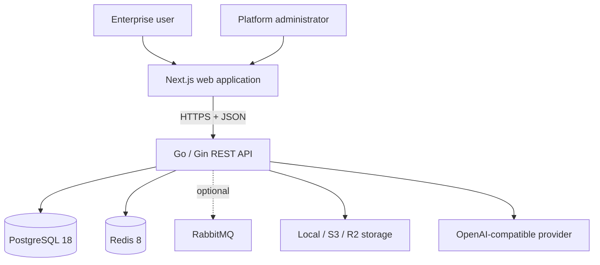
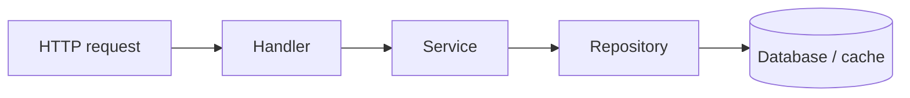

# Architecture

## Phase 1 decision record

NexaFlow starts as a modular monolith with a fully separated web client and REST
API. This keeps deployment and transactions understandable while preserving
module boundaries that can later be extracted when scale or team ownership—not
speculation—justifies distributed services.

### System context



### Backend dependency rule



- Handlers translate transport input and output; they never use GORM directly.
- Services own application rules and transaction boundaries.
- Repositories hide persistence details behind interfaces.
- Models contain transport-neutral domain and persistence data structures.
- Modules will compose these layers for each business capability.
- Shared packages are deliberately small and must not become a miscellaneous
  dependency bucket.

### First-run bootstrap mode

Before `.install.lock` exists, the API starts without requiring PostgreSQL or
Redis. Only health and installation capabilities are exposed at this phase of
the product. The install service validates input and owns orchestration; its
repository creates the database, runs GORM migrations, performs the bootstrap
transaction, and persists local runtime configuration. After installation,
readiness immediately checks the configured services and normal startup opens
persistent connection pools from the saved configuration.

### Tenancy boundary

Tenant isolation is enforced from Phase 3 onward, and its constraints remain
architectural across every later business module:

- Every tenant-owned business aggregate will carry a non-null `tenant_id`.
- Repository methods will require tenant scope; handlers cannot choose to omit it.
- Unique constraints and high-cardinality indexes will begin with `tenant_id`.
- Background jobs and audit events will carry tenant context explicitly.
- Database row-level security remains an optional defense-in-depth layer, not a
  replacement for scoped repositories and authorization checks.
- Identity is global, but membership and role assignment are tenant-scoped.
  Phase 3 uses additive migration tables so existing Phase 2 installations can
  be backfilled before authorization switches to mandatory active-tenant claims.

### Dynamic model boundary

Phase 4 exposes a deliberately small, deep module interface: define, list, get,
and archive an entire entity schema. HTTP handlers translate the REST contract,
the service normalizes and validates names, field types, options, and defaults,
and the repository owns the atomic persistence details. Callers never assemble
or mutate individual field rows.

Every module call requires `tenantID`; there is no unscoped repository method.
Schema replacements use optimistic versions and a transaction so concurrent
designers cannot partially overwrite a field collection. The stable entity and
field definitions are the shared contract consumed by Phase 5 records/forms,
Phase 6 workflows, and Phase 7 AI tools.

### Generated CRUD and form boundary

Phase 5 treats the dynamic schema as executable policy. The record service
loads the active entity definition, rejects unknown or invalid values, applies
defaults, and only then calls a tenant-scoped repository. Persistence stores a
single JSONB document plus relational concurrency/audit metadata; no request
can trigger DDL. Update and archive use optimistic versions.

The form service accepts an ordered mapping from entity fields to supported UI
widgets. It validates compatibility and generates JSON Schema draft 2020-12 on
the server. This keeps drag-and-drop layout concerns in the client while the
portable validation contract remains authoritative and reusable by APIs,
workflows, plugins, and AI tools.

### Workflow state-machine boundary

Phase 6 separates graph definition from execution. The service validates a
bounded acyclic graph and interprets automatic `start`, `condition`,
`notification`, and `end` nodes until it reaches an approval or terminal state.
Approvals use both live tenant RBAC and the node's required role. Record values
are obtained through the schema-aware record service, not queried directly by
the workflow repository.

Instance advancement, immutable action history, and notification outbox writes
share one database transaction. External delivery is deliberately outside that
transaction and consumes durable outbox rows with retries.

### AI Agent boundary

Phase 7 keeps inference outside the trust boundary. A configurable
OpenAI-compatible provider receives only context selected by registered tools.
Knowledge search uses tenant-scoped pgvector retrieval; business-record reads
reuse entity/record services and require live `record.view`. The model never
receives database credentials or arbitrary SQL capability.

Ingestion validates file type, size, expanded Office size, extracted text,
chunk count, and embedding dimension before an atomic write. Agent exchanges
persist question, response, sources, bounded tool metadata, and token use.
Provider failure remains visible and is never replaced by mock content.

### API contract

All versioned endpoints live under `/api/v1` and return:

```json
{
  "code": 0,
  "message": "success",
  "data": {}
}
```

Business error codes are stable integers distinct from HTTP status codes. A
request ID is accepted or generated and returned in `X-Request-ID`.

### Security baseline

- Parameterized access through GORM; raw SQL requires review and bound values.
- Explicit CORS allowlist; no wildcard origin with credentials.
- Uniform error envelopes that do not expose infrastructure errors.
- Structured request logs with correlation IDs.
- Non-root runtime containers and minimal production images.
- Secrets are injected at runtime and never committed.
- Authentication, rate limiting, CSRF strategy, token rotation, and tenant-aware
  authorization are delivered with Phases 2–4 before business data endpoints.

### Evolution rule

New modules must first be implemented as deep modules inside the monolith. A
service may be extracted only after its interface, ownership, data boundary, and
operational benefit are proven.
