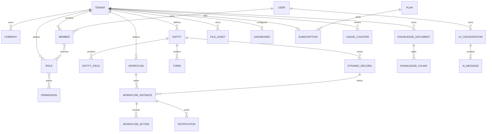

# Database design

## Phase 1 installation schema

The installer creates `companies`, `users`, `roles`, `permissions`,
`role_permissions`, `user_roles`, `refresh_sessions`, and `system_settings`. It
creates one company, one active user, four default roles, permission grants, and
the super-admin binding in a single transaction. Existing installed instances
run idempotent GORM migrations at startup as Phase 2 tables are introduced.

Refresh sessions store only token hashes, ownership, client metadata, expiry,
and revocation time. Role/permission and user/role assignments use join tables
with composite primary keys.

## Phase 3 tenancy migration foundation

Phase 3 adds `tenants`, `tenant_memberships`, `tenant_user_roles`, and
`tenant_role_permissions`. New installations create a primary tenant and bind
the company, super-admin membership, role, and permission grants to it. Existing
installations create a primary tenant on startup and idempotently backfill
legacy assignments. Live authorization reads only the tenant-scoped tables;
legacy joins remain migration input.

`companies.tenant_id` is nullable in the compatibility-shaped GORM model so an
older database can add the column before backfill. New installations always
populate it, and all live business access requires an active tenant context.

`refresh_sessions.tenant_id` uses a zero-UUID default only to allow PostgreSQL
to migrate existing rows; startup immediately backfills the primary tenant, and
all new sessions require an actual active tenant from service logic.

## Phase 4 dynamic entity schema

`entities` owns the tenant-scoped schema identity, description, lifecycle
status, and monotonically increasing version. `(tenant_id, slug)` is unique, so
the same business name may be defined independently by different tenants.
`entity_fields` stores ordered, typed field definitions and enforces unique
field names within an entity.

Field defaults and select options use JSONB because their JSON types vary by
field kind. Entity metadata remains relational. A schema update replaces its
field collection transactionally and increments `entities.version`; update and
archive operations compare the caller's `expected_version` to prevent silent
overwrites. Archive changes lifecycle status instead of deleting the schema,
preserving a stable reference for future records and workflow history.

The schema engine does not create PostgreSQL tables per customer-defined entity.
Phase 5 stores validated record values against these definitions, allowing
schema evolution without runtime DDL or generated application code.

## Phase 5 generated records and forms

`dynamic_records` stores one tenant/entity-scoped JSONB value object per row.
Metadata remains relational: version, lifecycle status, actor IDs, and UTC
timestamps support concurrency, ownership, and future audit feeds. The
tenant-first `(tenant_id, entity_id, created_at DESC)` index backs the initial
paginated listing path. Update/delete compare `version`; delete archives rather
than physically removing business data.

`forms` stores a tenant-local slug, immutable entity association, generated
JSON Schema, ordered component layout, lifecycle status, and version. Both
`json_schema` and `layout` are JSONB because they are validated documents whose
shape varies with the entity. The service, not the browser, is the authority
that generates JSON Schema and verifies widget/field compatibility.

Phase 5 intentionally does not expose arbitrary JSONB filtering or sorting.
Those query capabilities require a bounded, parameterized query language and
measured indexes; accepting raw SQL or JSON path fragments would violate the
repository boundary and tenant security model.

## Phase 6 workflow execution

`workflows` stores the tenant/entity association, versioned node graph, and
lifecycle status. Nodes and edges are JSONB validated as a reachable acyclic
graph before persistence. A saved workflow cannot change its entity.

`workflow_instances` binds one workflow to one dynamic record and stores its
current node, status, optimistic version, submitter, and timestamps.
`workflow_actions` is append-only approval/rejection history. Instance advance,
action history, and downstream notification creation share one transaction, so
a version conflict leaves none of those effects behind.

`notifications` is both the in-app notification store and a transactional
outbox for email/Webhook delivery. Tenant/user indexes support the inbox;
channel, recipient, and status allow a dispatcher to retry delivery without
replaying workflow state.

## Phase 7 knowledge and Agent audit

The official deployment enables pgvector. `knowledge_documents` stores tenant
ownership and ingestion metadata; `knowledge_chunks` stores text and a
1536-dimensional embedding. An HNSW cosine index backs nearest-neighbor search.
Queries join on document and tenant IDs and bind vector, tenant, and limit.

`ai_conversations` is tenant- and user-owned. `ai_messages` stores user and
assistant content plus JSONB source/tool-call audit records and provider token
usage. Reads require both tenant and owner IDs. Provider failure does not write
a fabricated assistant response.

This document is the living database contract for the implemented roadmap.
Tables are introduced through their owning bounded modules and idempotent
migrations rather than generated from browser input.

## Global conventions

- PostgreSQL 18, UTC timestamps, UUID v4 primary keys generated by the application.
- Table and column names use `snake_case`; business identifiers are separate
  from database primary keys.
- Tenant-owned tables use `tenant_id UUID NOT NULL` and tenant-first composite
  indexes such as `(tenant_id, created_at DESC)`.
- Soft deletion is used only when recovery or audit requirements justify it;
  it is not a universal default.
- JSONB is reserved for dynamic entity record values, configuration, and
  immutable event snapshots—not ordinary relational fields.
- Foreign keys remain enabled. High-write event tables may be partitioned only
  after measured need.
- Every migration has a forward path, rollback/risk note, and online-deployment
  consideration.

## Aggregate map

The diagram expresses ownership and cardinality; exact columns and indexes are
defined by the models and idempotent migration path.
