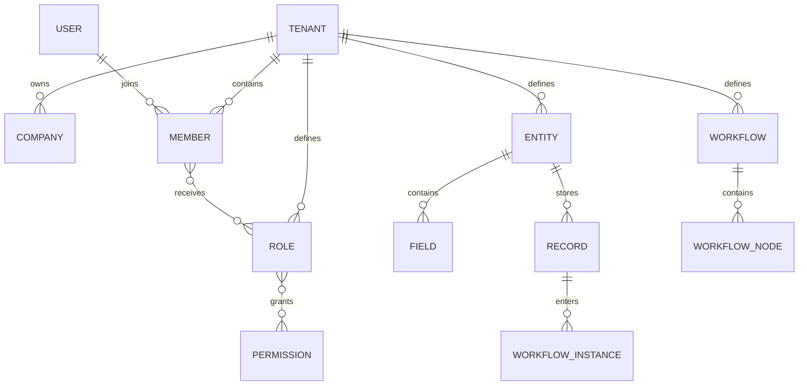

# Database design

## Phase 1 baseline

Phase 1 intentionally creates no business tables. The API opens and validates a
PostgreSQL connection, and the readiness repository checks both PostgreSQL and
Redis. Schema migrations begin with authentication in Phase 2.

This document is the living database contract and will gain the complete ER
model as each bounded module is implemented. Creating all tables during project
initialization would freeze untested assumptions and violate the phased roadmap.

## Global conventions

- PostgreSQL 18, UTC timestamps, UUID primary keys generated by the application.
- Table and column names use `snake_case`; business identifiers are separate
  from database primary keys.
- Tenant-owned tables use `tenant_id UUID NOT NULL` and tenant-first composite
  indexes such as `(tenant_id, created_at DESC)`.
- Soft deletion is used only when recovery or audit requirements justify it;
  it is not a universal default.
- JSONB is reserved for dynamic entity record values, configuration, and
  immutable event snapshots—not ordinary relational fields.
- Foreign keys remain enabled. High-write event tables may be partitioned only
  after measured need.
- Every migration has a forward path, rollback/risk note, and online-deployment
  consideration.

## Planned aggregate map

The diagram expresses ownership and cardinality, not final table columns. Exact
constraints and indexes will be added with the owning roadmap phase and covered
by migration tests.
