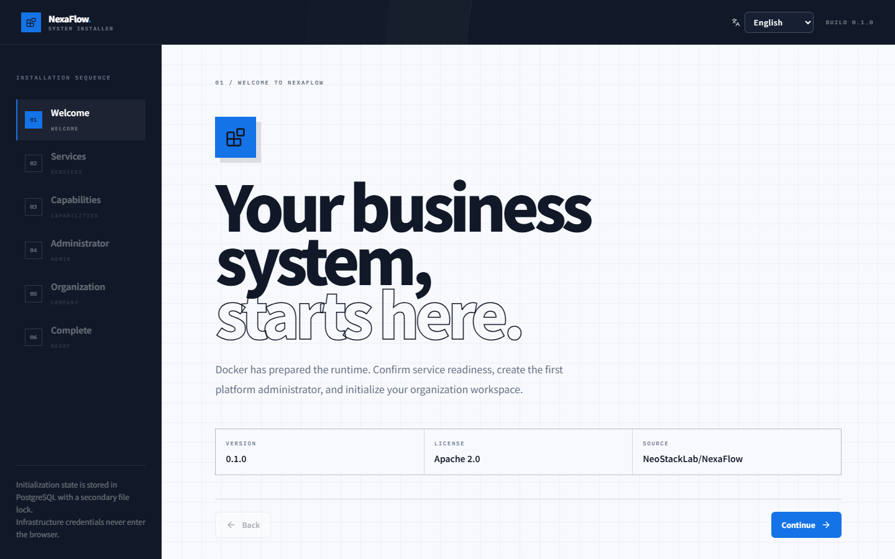
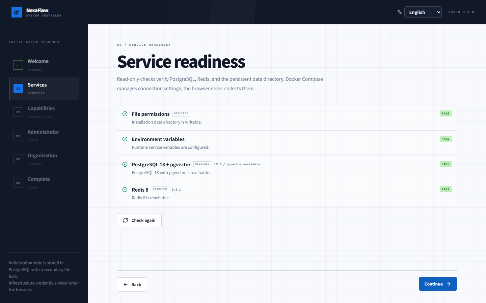
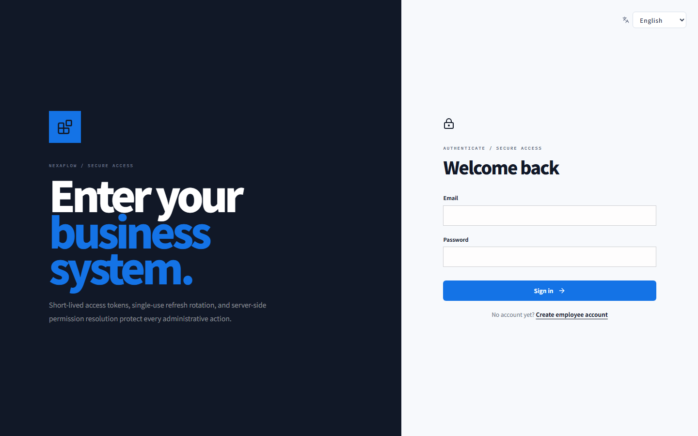
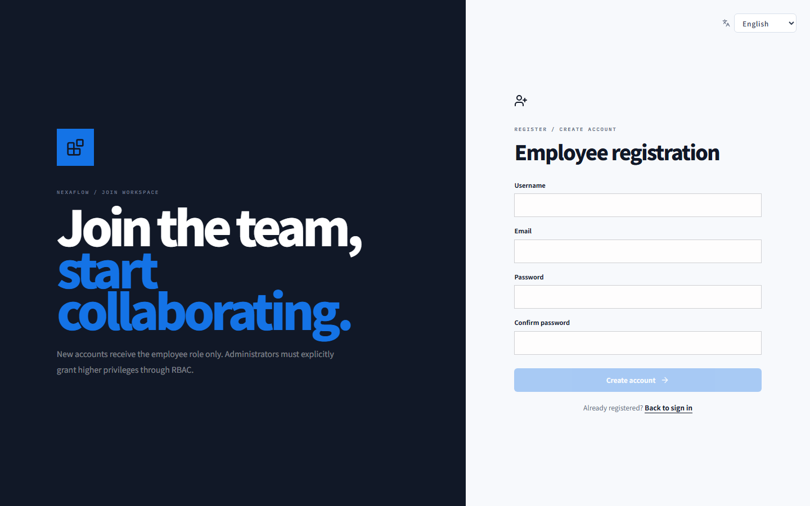
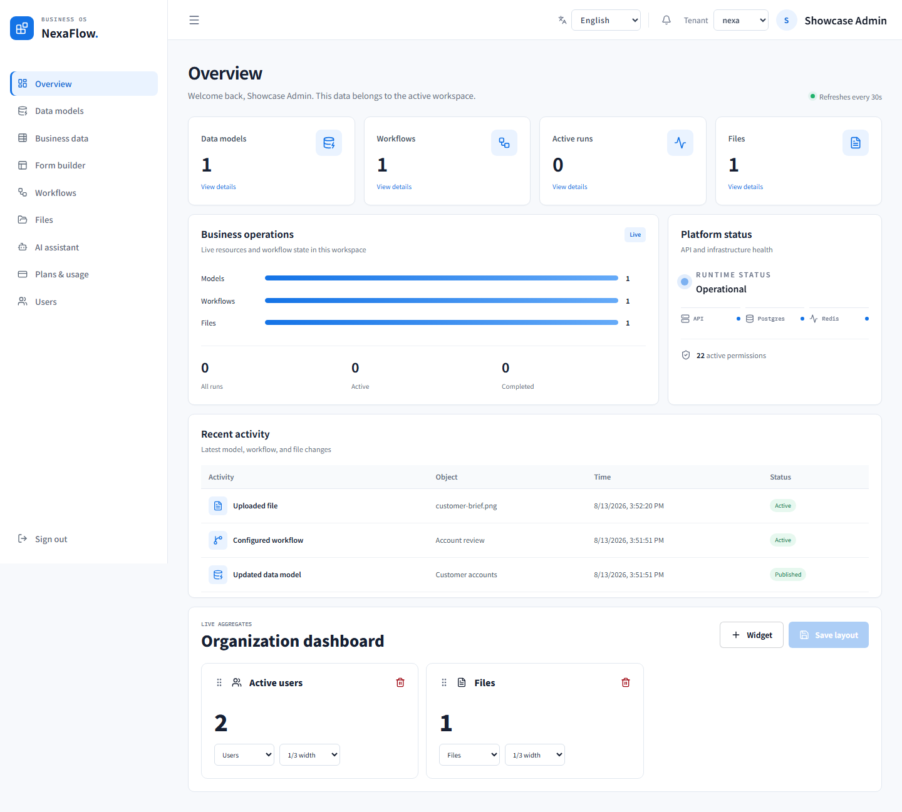
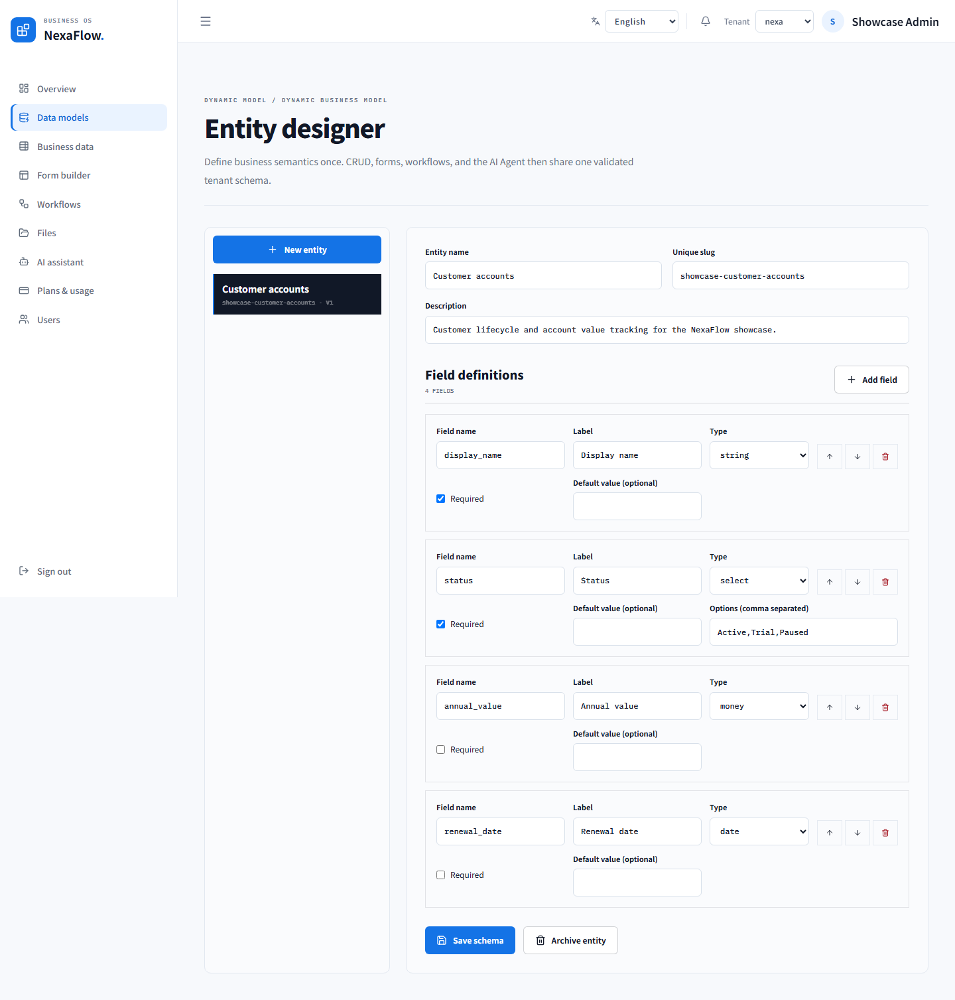
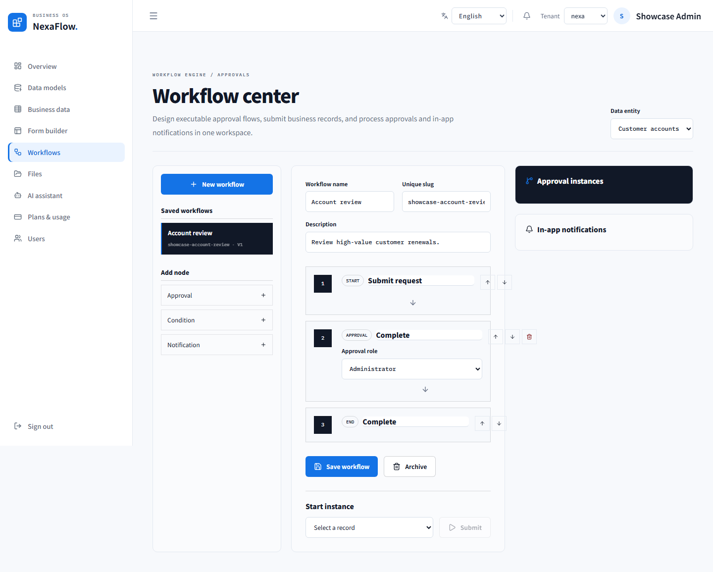
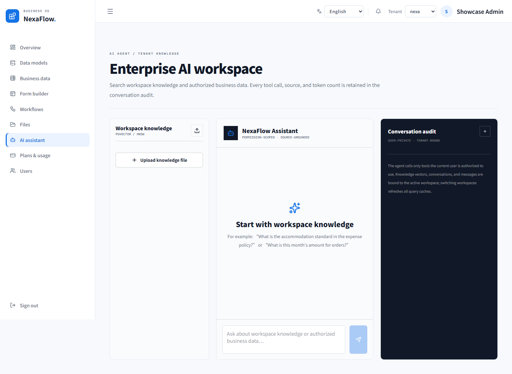
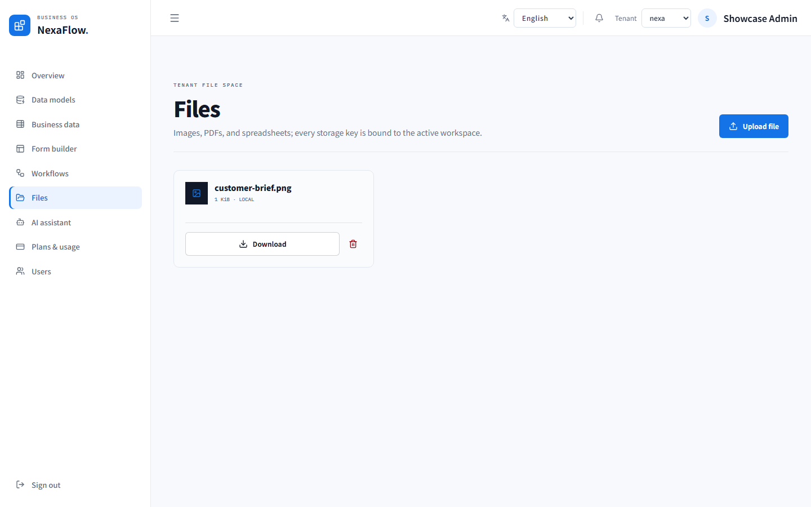
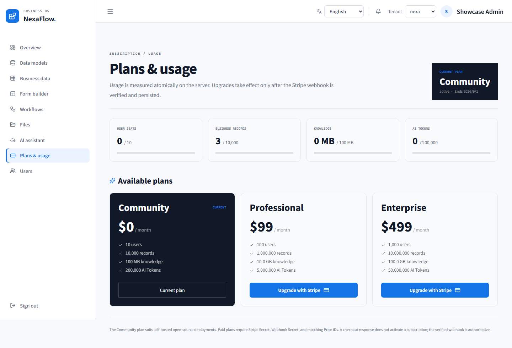

# NexaFlow screenshot catalog

These screenshots are current captures from the real Next.js application at desktop and mobile breakpoints. The capture session used the English locale and an isolated local showcase workspace with demonstration data only.

The installer readiness screen uses a read-only documentation fixture so the page can show every required check as passing without changing an installed instance. Authenticated screenshots use the normal login flow and the same local showcase fixture.

## Installation flow

## Authentication

## Administration console

All paths in this catalog are repository-relative so they render correctly in the root README and on GitHub.
